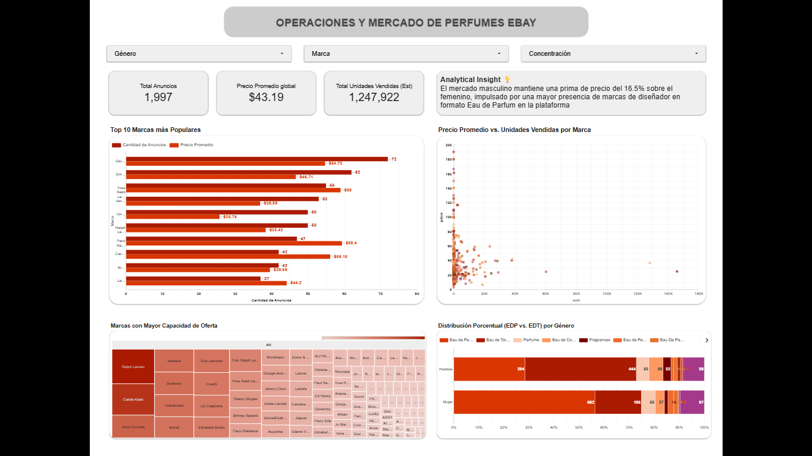

# 📊 Análisis de Mercado de Perfumes en eBay: De SQL a Business Intelligence

## 📝 Descripción del Proyecto
Este proyecto consiste en el diseño, limpieza, unificación y análisis estratégico de un conjunto de datos reales de perfumes (masculinos y femeninos) listados en eBay. El objetivo es extraer insights comerciales sobre el volumen de productos, estrategias de precios, nichos de lujo y preferencias del mercado, construyendo un pipeline analítico de extremo a extremo que va desde la base de datos relacional hasta un dashboard interactivo de negocio.

## 🛠️ Tecnologías Utilizadas
* **Base de Datos:** PostgreSQL
* **Entorno de Desarrollo:** VS Code (Anaconda Environment)
* **Lenguaje & Librerías:** SQL, Python 3.13 (Pandas, Matplotlib, Seaborn)
* **Business Intelligence:** Looker Studio / Power BI

---

## 💾 Fase 1: Ingeniería y Análisis Avanzado con SQL (PostgreSQL)

En esta etapa se diseñó la estructura relacional, se importaron los datos crudos y se ejecutaron consultas analíticas para responder preguntas críticas de negocio.

### 📌 Retos Resueltos & Insights Clave:
* **Reto 1: Top Marcas por Volumen y Posicionamiento de Precio**
  * *Insight:* Marcas comerciales masivas dominan el volumen de anuncios, pero conviven con marcas de nicho/lujo que distorsionan el promedio general, revelando un mercado secundario altamente fragmentado en eBay.
* **Reto 2: Análisis por Tipo de Concentración (Eau de Toilette vs. Eau de Parfum)**
  * *Insight:* El *Eau de Parfum* mantiene un precio promedio significativamente mayor ($58.83) frente al *Eau de Toilette* ($40.12), confirmando que el consumidor final está dispuesto a pagar un premium por una mayor concentración y durabilidad de la fragancia.
* **Reto 3: Consolidación del Mercado Global (Hombres vs. Mujeres)**
  * *Insight:* A pesar de tener un volumen de oferta idéntico en la muestra (1,000 anuncios por género), la categoría masculina promedia precios más altos ($46.48) que la femenina ($39.89).

---

## 🐍 Fase 2: Análisis Exploratorio de Datos (EDA) y Limpieza con Python

Migramos el flujo a Python para realizar una auditoría profunda de la calidad de los datos unificados, corregir inconsistencias y modelar la distribución estadística del mercado.

### 🧼 Acciones de Higiene y Limpieza de Datos:
* **Remedición Inteligente de Nulos:** Se tipificaron las ausencias según su naturaleza; las columnas de texto (`type`, `availableText`) se etiquetaron como `'No Especificado'`, mientras que las métricas numéricas (`sold`, `available`) se estandarizaron con `0` para proteger futuras operaciones matemáticas.
* **Remoción de Duplicados:** Se detectaron y eliminaron registros idénticos que duplicaban el volumen real de la muestra.
* **Tratamiento Analítico de Outliers:** Se aislaron los productos con precios superiores a los $150 USD, correspondientes a sets de lujo o ediciones de colección, para enfocar el análisis en el comportamiento del mercado masivo.

---

## 📊 Fase 3: Business Intelligence & Data Storytelling

Diseño e implementación de un dashboard ejecutivo interactivo orientado a la toma de decisiones comerciales, operaciones de inventario y análisis de posicionamiento de marca.

👉 **[ACCEDE AL DASHBOARD INTERACTIVO EN VIVO AQUÍ](https://datastudio.google.com/reporting/4c97164d-33b4-475f-bb2a-160e441eeb12)**

### 🏛️ Arquitectura del Tablero:
1. **Control Global e Indicadores Macro:** Filtros dinámicos por Género, Marca y Concentración acoplados a KPIs principales: Tamaño de Catálogo (**1,997 Anuncios**), Precio Promedio (**$43.19 USD**) y estimación de demanda global (**+1.2M Unidades Vendidas**).
2. **Matriz Comercial y de Competidores:** Cruce del Top 10 de marcas líderes en volumen contra una matriz de dispersión (*Scatter Plot*) de Precio vs. Ventas, aislando visualmente los productos de consumo masivo de los nichos Premium.
3. **Control de Operaciones y Tendencias:** Un mapa de rectángulos (*Treemap*) para evaluar la concentración de stock disponible (liderado por Ralph Lauren y Calvin Klein) y un gráfico de barras 100% apiladas para auditar la penetración del mercado de alta concentración (EDP vs. EDT) segmentado por género.

### 💡 Insight de Negocio Destacado:
> 🔍 **Análisis de Prima de Género:** El mercado masculino mantiene una prima de precio del **16.5%** sobre el femenino en la plataforma de eBay. Este fenómeno no es casualidad; está impulsado por una mayor retención de valor en marcas de diseñador específicas dentro de los formatos de uso diario (*Eau de Toilette*).

---

## 📂 Estructura del Repositorio
* `perfume_project.sql`: Script único estructurado de extremo a extremo. Contiene la creación de tablas, importación mediante `COPY` y las consultas analíticas.
* `3_eda_perfumes.py`: Script de Python enfocado en la unificación de archivos, auditoría de nulos/duplicados, limpieza avanzada y generación de gráficos estadísticos.
* `ebay_perfumes_global_limpio.csv`: Dataset final unificado, sanitizado y listo para ser explotado en herramientas de BI.
* `Dashboard.png, Densidad_precios_limpio.png, distribucion_precios.png`: Gráficos estadísticos y captura del Dashboard ejecutivo para documentación.
