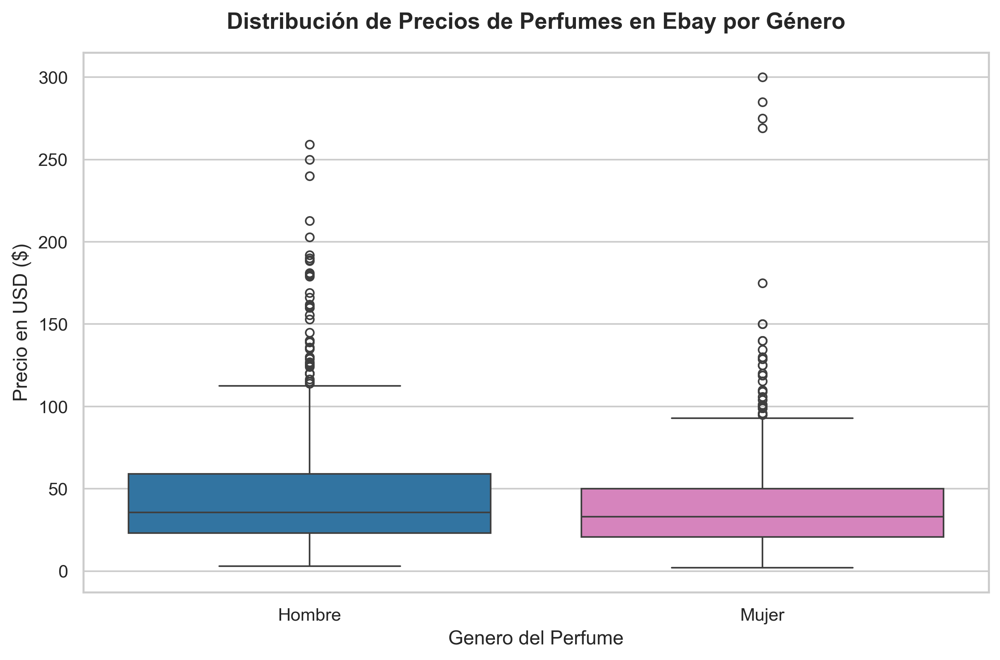
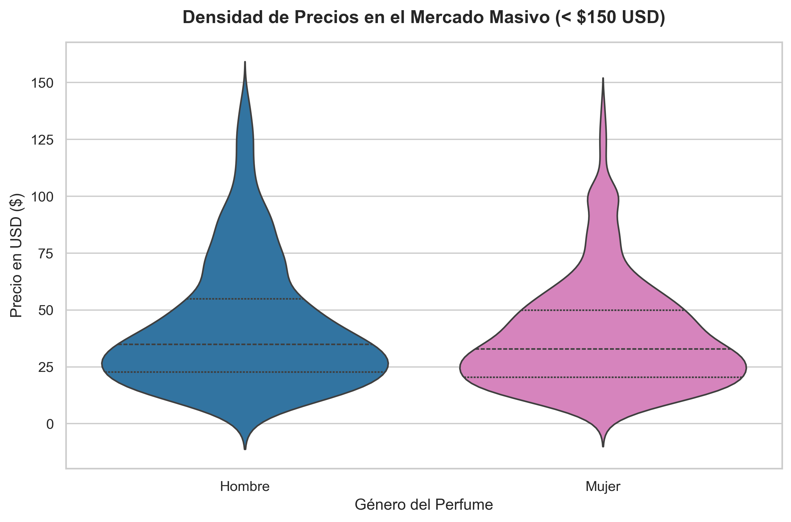

# 📊 Análisis de Mercado de Perfumes en eBay: De SQL a Python (EDA)

## 📝 Descripción del Proyecto
Este proyecto consiste en el diseño, limpieza, unificación y análisis estadístico de un conjunto de datos reales de perfumes (masculinos y femeninos) listados en eBay. El objetivo es extraer insights comerciales sobre el volumen de productos, estrategias de precios, nichos de lujo y preferencias del mercado, construyendo un pipeline analítico que va desde la base de datos relacional hasta el análisis exploratorio avanzado.

## 🛠️ Tecnologías Utilizadas
* **Base de Datos:** PostgreSQL
* **Entorno de Desarrollo:** VS Code (Anaconda Environment)
* **Lenguaje & Librerías:** SQL, Python 3.13 (Pandas, Matplotlib, Seaborn)

---

## 💾 Fase 1: Ingeniería y Análisis Avanzado con SQL (PostgreSQL)

En esta etapa se diseñó la estructura relacional, se importaron los datos crudos y se ejecutaron consultas analíticas para responder preguntas críticas de negocio.

### 📌 Retos Resueltos & Insights Clave:

* **Reto 1: Top Marcas por Volumen y Posicionamiento de Precio**
  * *Objetivo:* Identificar las marcas líderes en stock y evaluar su estrategia de precios en la plataforma.
  * *Insight:* Marcas comerciales masivas dominan el volumen de anuncios, pero conviven con marcas de nicho/lujo que distorsionan el promedio general, revelando un mercado secundario altamente fragmentado en eBay.

* **Reto 2: Análisis por Tipo de Concentración (Eau de Toilette vs. Eau de Parfum)**
  * *Objetivo:* Comparar métricas de precio (Mín, Máx, Prom) filtrando por categorías con alta presencia (>100 anuncios).
  * *Insight:* El *Eau de Parfum* mantiene un precio promedio significativamente mayor ($58.83) frente al *Eau de Toilette* ($40.12), confirmando que el consumidor final está dispuesto a pagar un premium por una mayor concentración y durabilidad de la fragancia.

* **Reto 3: Consolidación del Mercado Global (Hombres vs. Mujeres)**
  * *Objetivo:* Unificar los catálogos mediante subconsultas y `UNION ALL` para realizar un benchmark de género.
  * *Insight:* A pesar de tener un volumen de oferta idéntico en la muestra (1,000 anuncios por género), la categoría masculina promedia precios más altos ($46.48) que la femenina ($39.89).

---

## 🐍 Fase 2: Análisis Exploratorio de Datos (EDA) y Limpieza con Python

Migramos el flujo a Python para realizar una auditoría profunda de la calidad de los datos unificados, corregir inconsistencias y modelar la distribución estadística del mercado.

### 🧼 Acciones de Higiene y Limpieza de Datos:
* **Remedición Inteligente de Nulos:** Se tipificaron las ausencias según su naturaleza; las columnas de texto (`type`, `availableText`) se etiquetaron como `'No Especificado'`, mientras que las métricas numéricas (`sold`, `available`) se estandarizaron con `0` para proteger futuras operaciones matemáticas.
* **Remoción de Duplicados:** Se detectaron y eliminaron registros idénticos que duplicaban el volumen real de la muestra.
* **Tratamiento Analítico de Outliers:** Se aislaron los productos con precios superiores a los $150 USD, correspondientes a sets de lujo o ediciones de colección, para enfocar el análisis en el comportamiento del mercado masivo.

### 📊 Distribución y Densidad del Mercado (Insights Visuales):
A través de un análisis de diagnóstico con diagramas de caja (*Boxplots*), se observó que más del 95% de la oferta de eBay se concentra en un rango accesible (menor a $60 USD). Al aplicar un *Violinplot* para evaluar la densidad del mercado masivo (< $150 USD), se evidenció con mayor claridad la simetría y los picos de precio donde se concentran las decisiones de compra de los usuarios por género.

| Distribución Global (Con Outliers) | Densidad del Mercado Masivo (<$150) |
|:---:|:---:|
|  |  |

---

## 📂 Estructura del Repositorio
* `perfume_project.sql`: Script único estructurado de extremo a extremo. Contiene la creación de tablas, importación mediante `COPY` y las consultas analíticas.
* `3_eda_perfumes.py`: Script de Python enfocado en la unificación de archivos, auditoría de nulos/duplicados, limpieza avanzada y generación de gráficos estadísticos.
* `ebay_perfumes_global_limpio.csv`: Dataset final unificado, sanitizado y listo para ser explotado en herramientas de Business Intelligence.
* `*.png`: Gráficos exportados para la documentación del proyecto.
